<h1 align="center">ROS_Turtlebot3_Navigation</h1>

## Technical Documentation


<p align="center">
  <p align = "center">
     
     
    
  </p>
</p>

## Table of contents

- [Introduction](#introduction)
- [Objectives](#objectives)
- [Methodology](#methodology)
- [Implementation](#implementation)
- [Conclusion](#conclusion)
- [References](#references)

## Introduction

Robotics is one of the upcoming technologies that can change the world. With software, we can expand a robot's capabilities and by that, we can gives them life. If a robot exists, its capabilities such as control, sensing, and intelligence are realized using software. However, robotics software involves a combination of related technologies, such as computer vision, artificial intelligence, and control theory. Hence, developing software for a robot is not a simple task. It may require expertise in many fields. In order to help software developers create robot applications, one of the more popular robotics software frameworks that has been created is Robot Operating System (ROS).

There are many reasons why ROS is popular in robotics software development. One of them is its modular design. ROS was designed to be as distributed and modular as possible. Different tasks can be developed separately, giving developers choices: whether using completed parts from others or implementing by themselves. Moreover, it also provides hardware abstraction. An extensive knowledge of hardware is not required. A robot can be moved without much knowledge of specifiation of the robot or background mathematical in kinetics and dynamics. Hence, we can save our time and effort in development process. 

Within the scope of this project, we develop our robotics software using the platform TheConstruct. It is an online platform featuring Ubuntu as its operating system, combining with Gazebo as real world simulator and ROS kinetic, etc. The robot model is Turtlebot 3 Burger. Via this project, we want to apply the theory that we have learned in developing a simple program which can perform 4 different tasks. They will be explained in details in the next section.

## Objectives

The goal of this project is to:

- Create a script to move the robot around with simple /cmd_vel publishing.
- Create the mapping launches, and map the whole environment.
- Create a move base system which allows publishing the goal to **move_base** and avoiding obstacles while reaching that goal. 
- Create a program that allows the robot to navigate within the environment following a set of waypoints.


## Methodology

#### What is ROS?

ROS (Robot operating system) is a BSD-licensed system which allows controlling robotic components from a PC. ROS system consists of independent nodes that can communicate with each other through publish/subscribe messaging model. 

#### General concepts

- ROS Master <br></br>
ROS Master allows nodes in the system to communicate to each other through messages. It can be considered as a lookup table where all information related to nodes can be found. Therefore, it can help different nodes to locate each other and to start sending the messages.

<p align="center">
  <p align = "center">
     
  </p>
</p>


- ROS Node <br></br>
ROS node, according to ROS wiki, is basically a process that performs computation. It can be seen as an executable program running inside our application. 
The first advantage that ROS node brings to our application is reduction of code complexity. The application is much easier to scale when we divide it correctly into different packages and nodes. Secondly, it provides a great fault tolerance. Nodes communicate through ROS, they are not directly linked to each other. Therefore, when one node crashes, the other nodes still work. And it is a good feature for debugging. Thirdly, different nodes that are written in different language like Python, C++ etc can still communicate to each other without any problem. Undoubtedly, this is the best feature since we can increase the execution speed of certain nodes by writing them in C++ instead of Python for example.

- ROS Topics <br></br>
ROS topic acts like a middleman who is responsible to transmit the data between nodes so that they can communicate. A node that wants some information for other node, must subscribe to the topic that the other node published to. 

- ROS Messages <br></br>
The name says it all. This is the data structure that nodes publish to the topic in order to communicate with other nodes. 

- ROS Services <br></br>
A ROS service is a client/server system which is used to transfer the data between nodes. Here are some main characteristics of services.
  - It is synchronous, which means when a client sends a request, it will be blocked until receive a response from the server.
  - A service is defined by name, a pair of messages
  - The relation between server and client is one to many, which means one server can have many clients. 
Compared to topics, ROS services are kind of complement part of topics: client/server architecture vs unidirectional data streams. 
- ROS Action <br></br>
Action is very similar to service. It is an asynchronous call to other node's functionality. The main difference is unlike service, when a node call an action, it doesn't necessarily have to wait/to be blocked for/until that action is completed. 
  - The node that provides the functionality must have an action server, which allows the other nodes to call to its action functionality.
  - The node that calls to the functionality must have an action client, which allows this node to connect to the action server of another node.
  
- ROS Packages <br></br>
A ROS software is comprised of different packages. A package might contain anything that can be considered as an useful module like ROS nodes, ROS-independent library, configuration files, third-party software, dataset, etc. In general, a software is designed in the following principle: enough functionality to be useful and reusable, not too much functionality that the package becomes complicated and is hardly reused from other software. <br></br>
Normally, a package will contain the following files/folders:
  - launch folder: which contains all the launch files. Basically, a launch file describe the nodes that should be run, parameters that should be set, and other attributes of launching a collection of ROS nodes.
  - src folder: which contains all the sources files, especially Python source that are exported to other packages.
  - CMakeLists.txt: CMake build file
  - package.xml: a file, according to Wiki ROS, defines properties about the package such as the package name, version numbers, authors, maintainers, and dependencies on other catkin packages.
  
## Implementation

<h4 align="center">
  <ins>
    Task 1. Move the robot with simple <strong>/cmd_vel</strong> publishing
  </ins>
</h4>

Now we are going to create a script that move the robot by publishing the velocity to the <strong>/cmd_vel</strong> topic.

<ol>
  <li>
  First of all we need to create a launch file:
 
 ```
  <launch>
    <node pkg="t3_navigation" type ="move_robot.py" name="MoveRobot" output="screen"></node>      
  </launch>  
 ```
  This simple launch file states that we are going to create a node named MoveRobot of the package t3_navigation (our package we created for this project) and the logic control will be defined in move_robot.py file. 
  </li>
  
  <li>
  Now we need to investigate the <strong>/cmd_vel</strong> topic to see how can we publish the velocity to it. We start by checking if this topic exists. Type in this command:
  
 ```
   rostopic list 
 ```
  This will list all the current topics of the environment. <strong>/cmd_vel</strong> should appear in this list. 
  <p align="center">
    <p align = "center">
      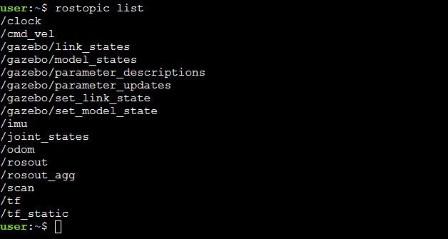
    </p>
  </p>
  
  Now we need to see what type of message this topic accepts. Check it by typing this command:
 
 ```
  rostopic info /cmd_vel 
 ```
  In the printed result, the type of message is shown as <strong>geometry_msgs/Twist</strong>. Now we know that the message we are going to send to this topic must be of type <strong>geometry_msgs/Twist</strong>. To know more about this message, use this command:
 
 ```
  rosmsg show geometry_msgs/Twist 
 ```
  <p align="center">
    <p align = "center">
      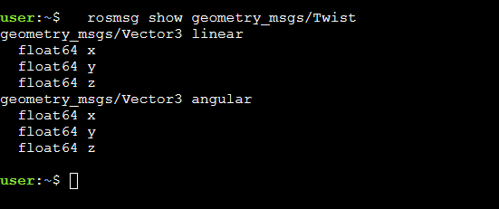
    </p>
  </p>
  
  So, this message contains velocity in free space broken into its linear and angular parts. 
 </li>
  
  <li>
    Now we need to create the python file which contains the logic control of the node. The robot will measure the distance from it to the nearest obstacle in front of it using the laser scan. To do this, we need to subscribe to the <strong>/scan</strong> topic, and add a callback function to handle the returned distance from the laser scan. If the distance is greater than 1 meter, it will keep moving. Otherwise, it will stop. To make it simple, we will let it move straight. In short, inside this code, we need to define the message of type <strong>geometry_msgs/Twist</strong>, and bind a value to the linear speed <strong>x</strong> to make it move straight. Here we set <strong>x</strong> to 0.5. Then publish this data to the <strong>/cmd_vel</strong> node. Here are some lines of code to demonstrate the idea, you can find the full version of this code in the <strong>move_robot.py</strong> file:
 
 ```
  ...
  # publish to /cmd_vel topic to send velocity information to the robot 
  self.pNode = rospy.Publisher('/cmd_vel', Twist, queue_size=1)

  # subscribe to /scan topic to get laser information 
  self.sNode = rospy.Subscriber('/scan', LaserScan, self.callback)

  self.twistMsg = Twist()
  self.laserMsg = LaserScan()
  
  # LaserScan Message callback
  def callback(self, msg):

      self.laserMsg = msg
      # If the distance between a robot and a wall is less than 1m, stop
      if self.getLaserDistance() < 1:
          self.twistMsg.linear.x = 0.0

      # Keep moving if the distance is greater than 1m.
      if self.getLaserDistance() > 1:
          self.twistMsg.linear.x = 0.5

      self.pNode.publish(self.twistMsg) 

  # Get laser distance value at 90 degree to know if there are any obstacle in front of the robot or not
  def getLaserDistance(self):
      if len(self.laserMsg.ranges) == 0:
          return 0
      return self.laserMsg.ranges[0]
  ...
 ```
  The distance is stored in the <strong>laserMsg</strong> variable, and it will be updated as long as our robot is moving. 
  </li>
</ol>
  
  Please find the demo video in this [link](https://www.loom.com/share/d5e659273b474adba19433513947922e?sharedAppSource=personal_library).
  
<h4 align="center">
  <ins>
    Task 2. Map the whole environment
  </ins>
</h4>

In this project, in order to navigate autonomously through the map, the map must be created first so that the robot can localize itself in it (or we can say it will remember the environment around). 
Here are the main steps to construct a map:

<ol>
  <li>
    Launch the package we developed above or use the <strong>turtlebot3_teleop_key.launch</strong> launch file from <strong>turtlebot3_teleop</strong> to move the Turtlebot 3 with the keyboard. <br></br>
    
  ```
    roslaunch turtlebot3_teleop turtlebot3_teleop_key.launch
  ```
     
  </li>
    
  <li>
    Then we are going to use the node <strong>slam_gmapping</strong> provided by <strong>gmapping</strong> package. We will create a new launch file, refer to this node and initialize the required parameters.
    
  ```
    <node pkg="gmapping" type="slam_gmapping" name="turtlebot3_slam_gmapping" output="screen">
        <param name="base_frame" value="base_footprint"/>
        <param name="odom_frame" value="odom"/>
        <param name="map_update_interval" value="2.0"/>
        <param name="maxUrange" value="6.0"/>
        ...
    </node>    
  ```
   Check the source code for the full version of this file. 

   Among these parameters, we pay attention only on <strong>maxUrange</strong> param since this parameter sets how far your laser will be considered to create the map. Greater range will create maps faster and its less probable that the robot gets lost. The downside its that consumes more resources. Here we set it to 6. 
   Now we are able to use this node to create the 2D map of the environment. When the robot start moving, the odometry and the laser scans collected from the LiDAR sensor will be combined to create an occupancy map. In this 2D map, each cell represents the probability of occupancy (whether this cell is free or occupied or unknown). The data format of this map is <strong>nav_msgs/OccupancyGrid.msg</strong>:
    
  ```
    std_msgs/Header header
    nav_msgs/MapMetaData info
    int8[] data
  ```
  Here the <strong>data</strong> variable contains the probabilities of occupancy ranging from 0 to 100 where 0 represents completely free and 100 represents completely occupied, -1 for unknown cases. 
  </li>
  
  <li>
    We can track the mapping process by using the visualization tool <strong>RViz</strong>. We have 2 options: either launch a naked RViz and then add the proper elements like <strong>LaserScan</strong> and <strong>Map</strong> or launch RViz with a predefined configuration for mapping. Here we will go with 2nd option. Launch this tool by type the command to the terminal:
  
  ```
    rosrun rviz rviz -d `rospack find turtlebot3_slam`/rviz/turtlebot3_slam.rviz
  ```
    
  Or we can add this command to the launch file so that instead of running 2 different commands (1 for launch file and 1 for this RViz tool), we need to run only the command for launch file. 
  
  ```
    <node type="rviz" name="rviz_mapping_pkg" pkg="rviz" args="-d $(find turtlebot3_slam)/rviz/turtlebot3_slam.rviz" />
  ```
    
  Here are some screenshots when you start the mapping process:
  

  <p align="center">
    <p align = "center">
      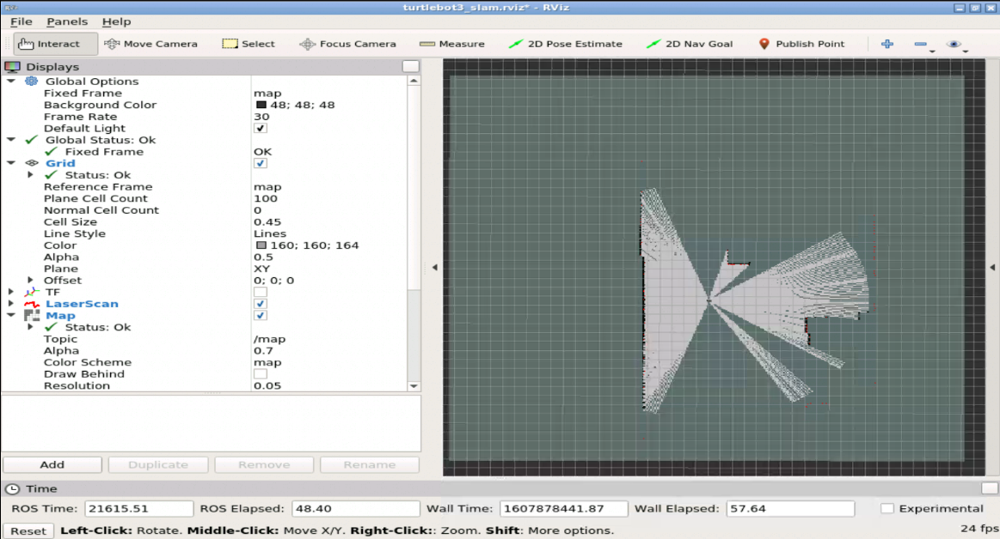
      <em> Initial RViz screen</em>
    </p>
  </p>

  <p align="center">
    <p align = "center">
      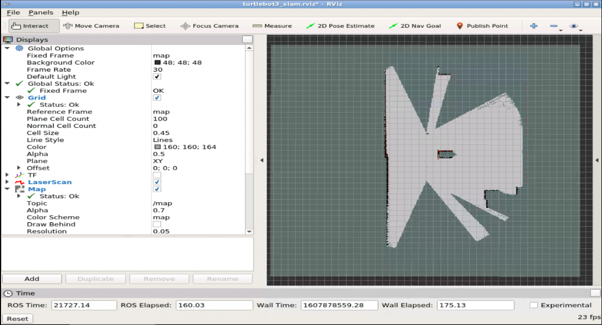
      <em> Robot is moving around the environment</em>
    </p>
  </p>

  <p align="center">
    <p align = "center">
      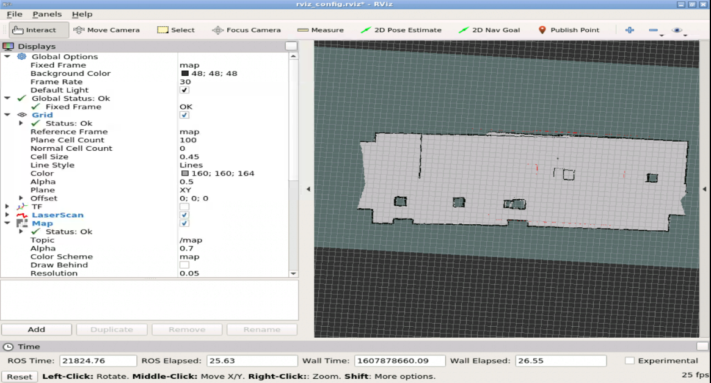
      <em> The map is completed </em>
    </p>
  </p>
  
  </li>
  
  <li>
    After the map is constructed, we can save it so that we can use it later. By typing this command:
  
      rosrun map_server map_saver -f caffeteria
      
   the map is saved with the name <strong>caffeteria</strong>. Modify it with any other name as you want. 
   This will create 2 different files:
    
  - A Portable Map Gray (PGM) file contains the occupancy map data.
  - A yaml file contains the metadata of the map such as image, resolution, origin, etc.
    
    
  </li>
</ol>

  Please find the demo video in this [link](https://www.loom.com/share/c03b0511fd9b40fea0e0cff1d518bae3?sharedAppSource=personal_library).


<h4 align="center">
  <ins>
    Task 3. Reach a goal while avoiding obstacles
  </ins>
</h4>

This task can be considered as a combination of 2 tasks: 

<ol>
  <li>
    <h4> Localization </h4>
    In order to localize the robot, we are going to use the <strong>amcl</strong> node provided by <strong>AMCL (Adaptive Monte Carlo Localization)</strong> package. Basically, it uses an adaptive particle filter to track the pose of the robot with respect to the known 2D map. 
   
   Just like the previous task, now we need to create a launch file for this:
   
   -  Add the constructed map and run with the map server node:
   
      ```
            <arg name="map_file" default="$(find t3_navigation)/maps/caffeteria.yaml"/>
            <node name="map_server" pkg="map_server" type="map_server" args="$(arg map_file)" />
      ```
   -  Add the amcl node as well as the required parameters:
   
      ```
        <node pkg="amcl" type="amcl" name="amcl">
            <param name="min_particles"             value="1000"/>
            <param name="max_particles"             value="5000"/>
            <param name="kld_err"                   value="0.02"/>
            <param name="update_min_d"              value="0.20"/>
            <param name="update_min_a"              value="0.20"/>
            ....
        </node>
      ```
   Check the source code for the full version of this file. 
   The list of topics that it subscribes to and the corresponding message:
    
  - <strong>/map (nav_msgs/OccupancyGrid)</strong>: get the constructed map for localization task
  - <strong>/scan (sensor_msgs/LaserScan)</strong>: get the laser scan data
  - <strong>/initialpose (geometry_msgs/PoseWithCovarianceStamped)</strong>: get the pose to initialize particle filter
  
   The list of topics that it publishes to and the corresponding message:
      
  - <strong>/amcl_pose (geometry_msgs/PoseWithCovarianceStamped)</strong>: publish the estimated pose of the robot with covariance (the uncertainty of the measurement)
  - <strong>/particlecloud (geometry_msgs/PoseArray)</strong>: publish the set of pose estimation maintained by the filter (this set can be visualized in RViz by adding a PoseArray display which subscribes to this topic as shown in the figure below)
  
   Besides, this node also subcribes and publishes at the same time to the topic <strong>/tf</strong> which is necessary to provide relationship between different frames. 
   
   Now let's test our localization task by running the commands:<br>
       ```
        roslaunch t3_navigation start_localization.launch
       ```
   <br>to start the launch file and <br>
       ```
        roslaunch turtlebot3_teleop turtlebot3_teleop_key.launch
       ```
   <br> to control the robot with the keyboard.
   
   Now switch to RViz screen (RViz running command is already included in the launch file). The screen should look like this:
   
  <p align="center">
    <p align = "center">
      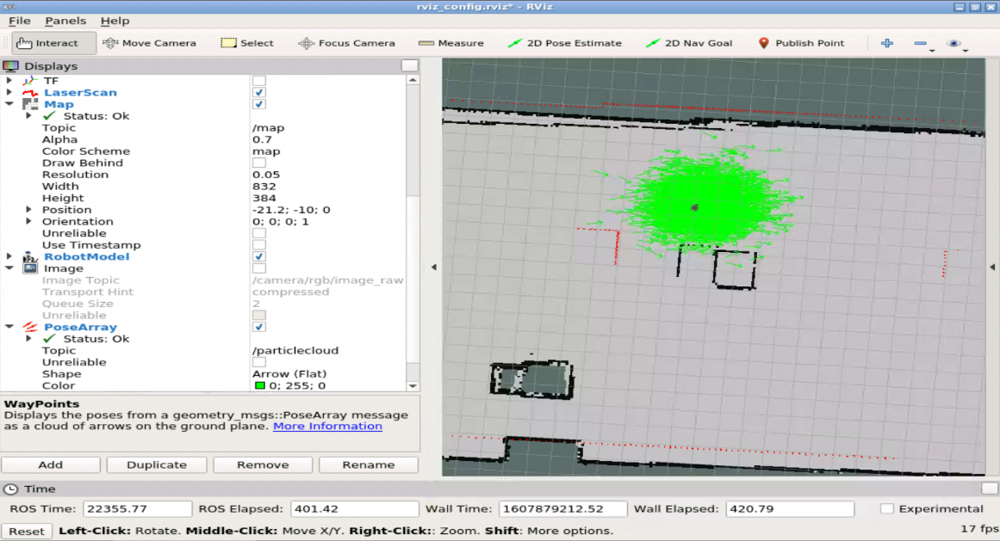
      <em> Initial state </em>
    </p>
  </p>
   
   First of all, we need to send a initial pose to the <strong>amcl</strong> node. This can be done by using the function <strong>2D Pose Estimate </strong> of RViz tool. Click on the button then click on the approximate initial pose of the robot on the map. A message will be published to <strong>/initialpose</strong> topic which <strong>amcl</strong> node subscribes to. Initially, the number of particles is very large. As we start moving the robot, the node will start the localization process, and when the robot pose is well estimated, the number of particles is decreased. This number of particles represents the uncertainty of robot pose estimation. The more uncertain the more particles it will have. Due to the ability to adjust the amount of particles on the fly, it is called <strong>adaptive</strong>. This enables the robot to make a trade-off between processing speed and localization accuracy.
   
  <p align="center">
    <p align = "center">
      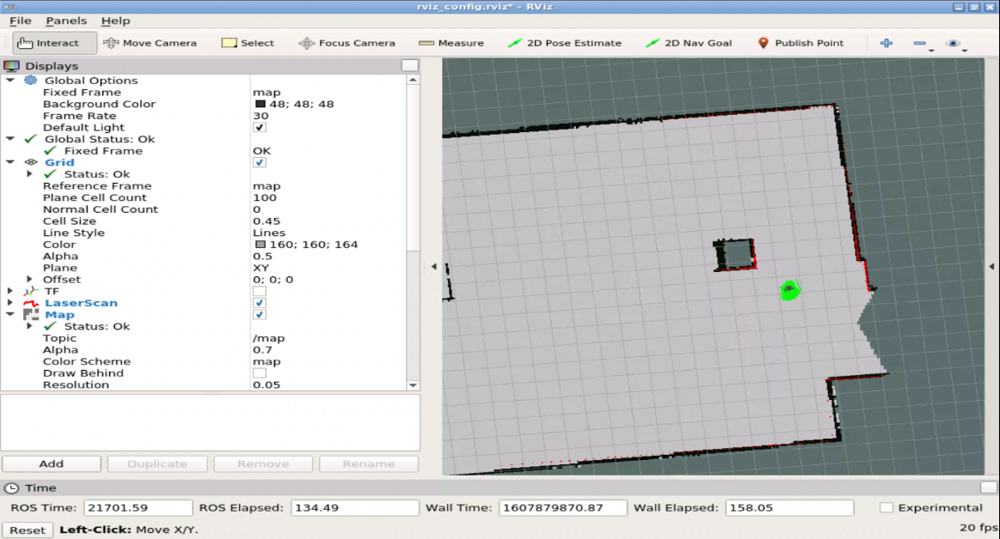
      <em> Complete localization </em>
    </p>
  </p>
   
   Et voila, our robot pose is well estimated. 
  </li>
  
  <li>
    <h4> Path Planning </h4>
  
  Now we already have the constructed map and we are able to localize the robot on the map. That is everything we need to start the path planning process.
  This time, we are going to use the <strong>move_base</strong> node provided by the <strong>move_base</strong> package, which is a part of the navigation stack (see the image below). This node links together the a global and local planner to accomplish its global navigation task. 
  <p align="center">
    <p align = "center">
      
      <em> The navigation stack </em>
    </p>
  </p>
  
  Here is the list of topics that this node subscribes and publishes to. It's worth mentioning that this node provides an implementation of <strong>SimpleActionServer</strong> from <strong>action_lib</strong> package. There are 2 ways to send a goal to this node, either by this implementation or not. See the list below. 
  
  - <strong>move_base/goal (move_base_msgs/MoveBaseActionGoal)</strong>: receive the goal using SimpleActionServer and keep track of the goal status.
  - <strong>move_base_simple/goal (geometry_msgs/PoseStamped)</strong>: receive the goal without using SimpleActionServer (cannot keep track of the goal status).
  - <strong>/cmd_vel (geometry_msgs/Twist)</strong>: publish the velocity information to the mobile base. 
  
  This time, before creating launch file for this task, we need to define all the required parameters first. 
  
  - <strong>costmap_common_params_burger.yaml</strong>: 
  
          ...
          raytrace_range: 3.5
          observation_sources: scan
          scan: {data_type: LaserScan, topic: scan, marking: true, clearing: true}
          ...
     
     Just note the observation_sources parameters, that uses the topic /scan to read the laser readings. The camera is not used for navigation. Also note the ray trace range is only 3.5 meters. This is just to make detections faster and not have in mind areas that aren't close enough.

  - <strong>local_costmap_params.yaml</strong>:
        
      ```
        ...
        static_map: false
        ...
      ```
     Note that the static_map parmeter is set to False. This is because the local costmap is built from the laser readings, not from any static map.

  - <strong>global_costmap_params.yaml</strong>:
  
      ```
        ...
        static_map: true
        ...
      ```
     Note that the static_map parmeter is here set to True. This is because the global costmap is built from the static map you created in previous steps.

  - <strong>move_base_params.yaml</strong>:  These are some general parameters for the move_base node.

  - <strong>dwa_local_planner_params.yaml</strong>: These are some parameters related to the local planner.
  
  Now we are going to create a launch file for this task which includes every parameter files above. 
        
        ...
        <node pkg="move_base" type="move_base" respawn="false" name="move_base" output="screen">
              <param name="base_local_planner" value="dwa_local_planner/DWAPlannerROS" />

              <rosparam file="$(find t3_navigation)/param/costmap_common_params_$(arg model).yaml" command="load" ns="global_costmap" />
              <rosparam file="$(find t3_navigation)/param/costmap_common_params_$(arg model).yaml" command="load" ns="local_costmap" />
              <rosparam file="$(find t3_navigation)/param/local_costmap_params.yaml" command="load" />
              <rosparam file="$(find t3_navigation)/param/global_costmap_params.yaml" command="load" />
              <rosparam file="$(find t3_navigation)/param/move_base_params.yaml" command="load" />
              <rosparam file="$(find t3_navigation)/param/dwa_local_planner_params.yaml" command="load" />
        </node>
        ...
  Check the source code for the full version of this file. 
  Now run this command and open RViz screen:
        
        roslaunch t3_navigation start_navigation.launch
  
  We start by choose the initial pose of the robot like we did above. Click on <strong>2D Pose Estimate</strong> and click on the map to choose the initial pose. Then click on <strong>2D Nav Goal</strong> and click on the map to choose the goal. After creating a goal, a goal message (geometry_msgs/PoseStamped) will be published to /move_base_simple/goal topic. Then we can see the robot start moving towards the goal, the <strong>move_base</strong> node will take care of the obstacles avoiding task as well. 
  <p align="center">
    <p align = "center">
      
      <em> Initial state </em>
    </p>
  </p>
  
  <p align="center">
    <p align = "center">
      
      <em> Complete navigation </em>
    </p>
  </p>
  </li>
</ol>

  Please find the demo video in this [link](https://www.loom.com/share/6afbf04ad23d48feab3bf1e4fb693ac3?sharedAppSource=personal_library).

<h4 align="center">
  <ins>
    Task 4. Navigate through the map following a set of waypoints 
  </ins>
</h4>

  For this task, we are going to adopt the code from [this repository](https://github.com/danielsnider/follow_waypoints). This package performs the navigation task by using the <strong>2D Pose Estimate</strong> of RViz tool as a method to create waypoints. This server will listen to publications into the topic <strong>/initialpose</strong> and store those poses until its instructed to send them to move_base to be executed. However, this approach has a small drawback. Your last waypoint must be the same as the initial pose of the robot since our localization module will take the last waypoint as the estimate pose. Due to this reason, we propose another approach using the <strong>Publish Point</strong> button of RViz instead of <strong>2D Pose Estimate</strong>. This function will publish the waypoint to the topic <strong>/clicked_point</strong> instead of <strong>/initialpose</strong>. Therefore, it does not affect the localization module. However, the type of message that is sent to <strong>/clicked_point</strong> is <strong>geometry_msgs/PointStamped</strong>. Hence, we need to convert it to <strong>geometry_msgs/PoseWithCovarianceStamped</strong> before sending all these waypoints to the <strong>move_base</strong>. 
  
  So, we start by creating a launch file for this:
    
   - Change the way logs are shown. In this case it will show which node, function and line in the code is that log executed.
   
    <env name="ROSCONSOLE_FORMAT" value="[${severity}][${thread}][${node}/${function}:${line}]: ${message}"/>
   
   - Define the topic where we will public the waypoint.
   
    <arg name="waypoints_topic" default="/clicked_point"/>
   
   - Define the node custom_follow_waypoints as well as the frame and the topic params values.
   
    <node pkg="t3_navigation" type="custom_follow_waypoints.py" name="custom_follow_waypoints" output="screen" clear_params="true">
        <param name="goal_frame_id" value="map"/>
        <param name="custom_waypointstopic" value="$(arg waypoints_topic)"/>
    </node>
  
  Then, we make modifications as discussed above to the original file <strong>follow_waypoints.py</strong> and rename it <strong>custom_follow_waypoints.py</strong>
  
  Now run these commands to perform the task:
    
    roslaunch t3_navigation start_navigation.launch
    roslaunch t3_navigation start_follow_waypoints.launch
  
  Switch to RViz screen. We start by set the initial position of the robot. Then click on the <strong>Publish Point</strong> to create waypoint. After that, send all the waypoints to <strong>move_base</strong> node by running this command:
  
     rostopic pub /path_ready std_msgs/Empty -1

This command will publish a message (of type <strong>std_msgs/Empty</strong>) to the <strong>/path_ready</strong> topic. It means all the waypoints have been set and start the following waypoint process. 
The RViz screen should look like this. 

  <p align="center">
    <p align = "center">
      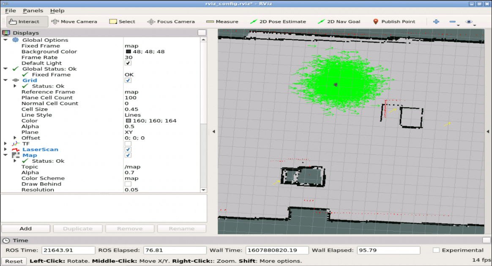
      <em> Initialize the set of waypoints (marked as yellow arrow) </em>
    </p>
  </p>

  <p align="center">
    <p align = "center">
      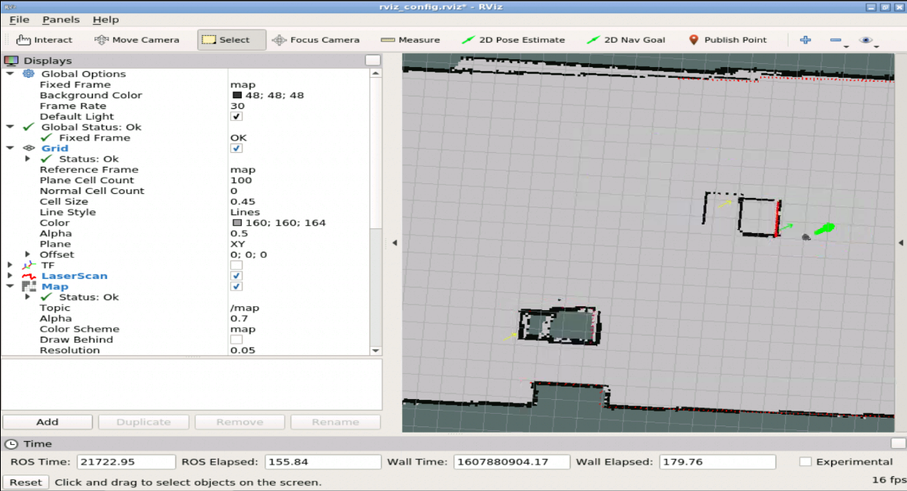
      <em> Robot moved to the 1st waypoint </em>
    </p>
  </p>

  <p align="center">
    <p align = "center">
      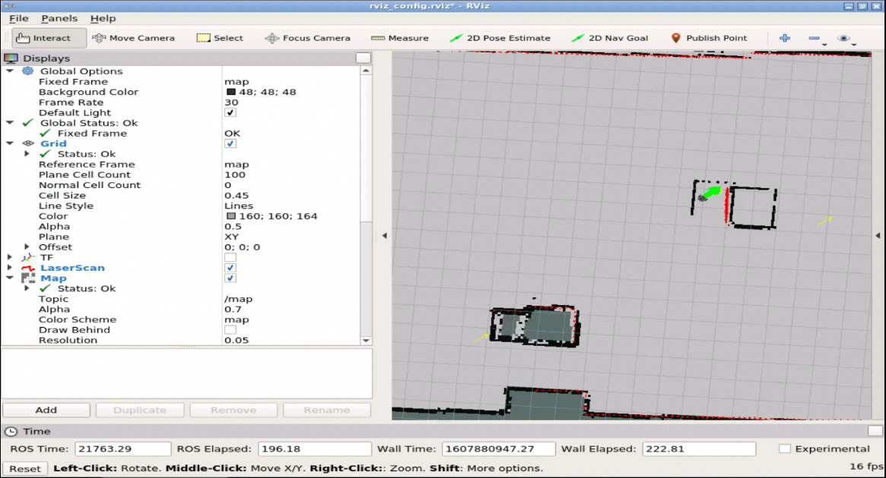
      <em> Robot reached the 2nd waypoint </em>
    </p>
  </p>
  
  <p align="center">
    <p align = "center">
      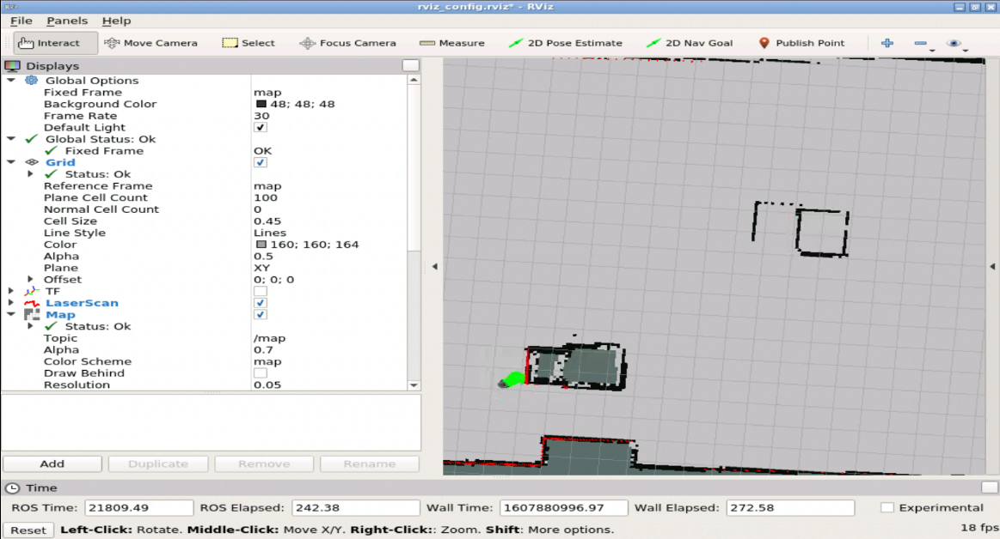
      <em> Robot reached the last waypoint </em>
    </p>
  </p>

Here we notice that the waypoint is represented by an yellow arrow of the same orientation. This is because when we convert the waypoint from type <strong>geometry_msgs/PointStamped</strong>, which only contains position data, to <strong>geometry_msgs/PoseWithCovarianceStamped</strong> which is defined by both position and orientation data, we set the orientation fixed for every waypoints. This is acceptable since we do not require orientation for our waypoints.
  
  Please find the demo video in this [link](https://www.loom.com/share/3714fcd1aed5456cba12ef70d636926a?sharedAppSource=personal_library).

## Conclusion
  This entry level project is a good start for us to apply what we have learned so far about ROS in developing a simple robotic application. We have completed 4 differents tasks: Move the robot with simple /cmd_vel publishing, mapping an environment to 2D map, navigating inside that map and following a set of waypoints. These interesting tasks cover all the basic of ROS: node, topic, publishers/subscribers, messages, etc. Via this project, we get to know how the modular design helps ROS become very popular in the robotic software community. The freedom of integrating different nodes together is a very strong feature. It helps developers save their time and effort. Beside, TheConstruct platform is very helpful for newbies like us in learning ROS with many useful courses. Undoubtedly, this project is a cornerstone for the later steps in learning ROS. <br>
  I would like to say thank to Professor Ralph SEULIN, Raphael DUVERNE and Daniel BRAUN. I really appreciate your time and effort in guiding me through this project. 
  
## References
  - [Wiki ROS](http://wiki.ros.org/)
  - [Follow waypoint package](https://github.com/danielsnider/follow_waypoints)
  - ROS By Example, A Do-It-Yourself Guide to the Robot Operating System, VOLUME 1, A PI ROBOT PRODUCTION, R. PATRICK GOEBEL
