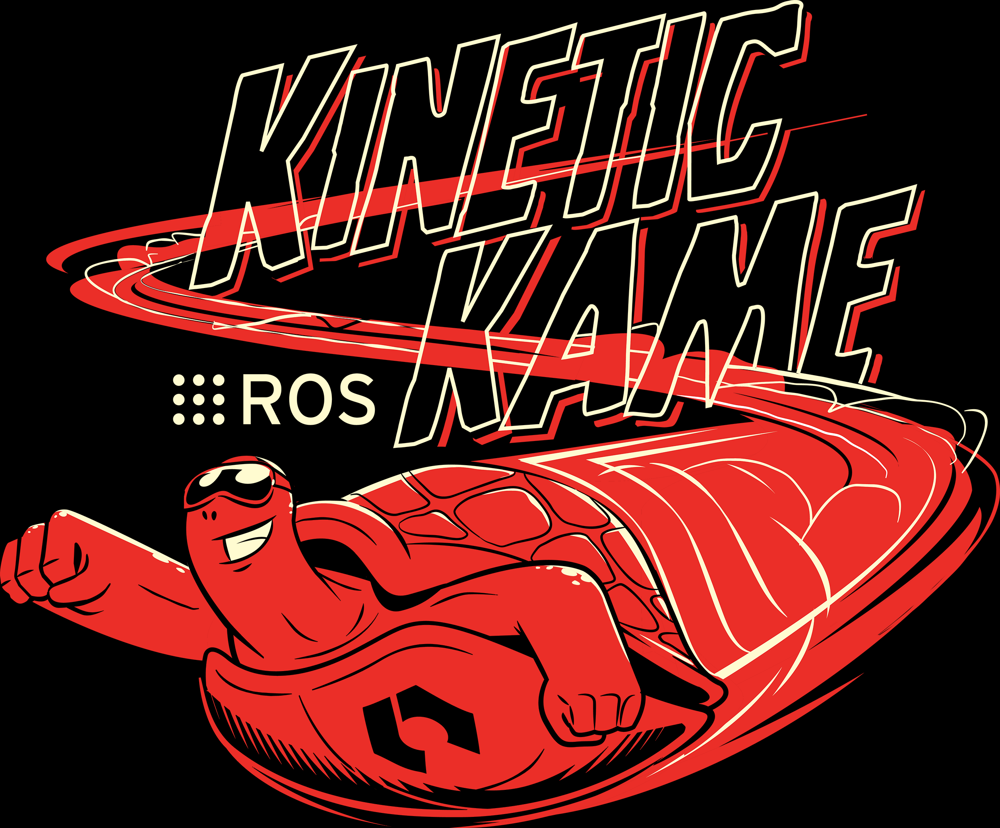

<h1 align="center">ROS_Turtlebot3_Navigation</h1>

## Technical Documentation


<p align="center">
  <p align = "center">
     
     
    
  </p>
</p>

## Table of contents

- [Introduction](#introduction)
- [Objectives](#objectives)
- [Methodology](#methodology)
- [Implementation](#implementation)
- [Conclusion](#conclusion)
- [References](#references)

## Introduction

Robotics is one of the upcoming technologies that can change the world. With software, we can expand a robot's capabilities and by that, we can gives them life. If a robot exists, its capabilities such as control, sensing, and intelligence are realized using software. However, robotics software involves a combination of related technologies, such as computer vision, artificial intelligence, and control theory. Hence, developing software for a robot is not a simple task. It may require expertise in many fields. In order to help software developers create robot applications, one of the more popular robotics software frameworks that has been created is Robot Operating System (ROS).

There are many reasons why ROS is popular in robotics software development. One of them is its modular design. ROS was designed to be as distributed and modular as possible. Different tasks can be developed separately, giving developers choices: whether using completed parts from others or implementing by themselves. Moreover, it also provides hardware abstraction. An extensive knowledge of hardware is not required. A robot can be moved without much knowledge of specifiation of the robot or background mathematical in kinetics and dynamics. Hence, we can save our time and effort in development process. 

Within the scope of this project, we develop our robotics software using the platform TheConstruct. It is an online platform featuring Ubuntu as its operating system, combining with Gazebo as real world simulator and ROS kinetic, etc. The robot model is Turtlebot 3 Burger. Via this project, we want to apply the theory that we have learned in developing a simple program which can perform 4 different tasks. They will be explained in details in the next section.

## Objectives

The goal of this project is to:

- Create a script to move the robot around with simple /cmd_vel publishing.
- Create the mapping launches, and map the whole environment.
- Create a move base system which allows publishing the goal to **move_base** and avoiding obstacles while reaching that goal. 
- Create a program that allows the robot to navigate within the environment following a set of waypoints.


## Methodology

#### What is ROS?

ROS (Robot operating system) is a BSD-licensed system which allows controlling robotic components from a PC. ROS system consists of independent nodes that can communicate with each other through publish/subscribe messaging model. 

#### General concepts

- ROS Master <br></br>
ROS Master allows nodes in the system to communicate to each other through messages. It can be considered as a lookup table where all information related to nodes can be found. Therefore, it can help different nodes to locate each other and to start sending the messages.

<p align="center">
  <p align = "center">
     
  </p>
</p>


- ROS Node <br></br>
ROS node, according to ROS wiki, is basically a process that performs computation. It can be seen as an executable program running inside our application. 
The first advantage that ROS node brings to our application is reduction of code complexity. The application is much easier to scale when we divide it correctly into different packages and nodes. Secondly, it provides a great fault tolerance. Nodes communicate through ROS, they are not directly linked to each other. Therefore, when one node crashes, the other nodes still work. And it is a good feature for debugging. Thirdly, different nodes that are written in different language like Python, C++ etc can still communicate to each other without any problem. Undoubtedly, this is the best feature since we can increase the execution speed of certain nodes by writing them in C++ instead of Python for example.

- ROS Topics <br></br>
ROS topic acts like a middleman who is responsible to transmit the data between nodes so that they can communicate. A node that wants some information for other node, must subscribe to the topic that the other node published to. 

- ROS Messages <br></br>
The name says it all. This is the data structure that nodes publish to the topic in order to communicate with other nodes. 

- ROS Services <br></br>
A ROS service is a client/server system which is used to transfer the data between nodes. Here are some main characteristics of services.
  - It is synchronous, which means when a client sends a request, it will be blocked until receive a response from the server.
  - A service is defined by name, a pair of messages
  - The relation between server and client is one to many, which means one server can have many clients. 
Compared to topics, ROS services are kind of complement part of topics: client/server architecture vs unidirectional data streams. 
- ROS Action <br></br>
Action is very similar to service. It is an asynchronous call to other node's functionality. The main difference is unlike service, when a node call an action, it doesn't necessarily have to wait/to be blocked for/until that action is completed. 
  - The node that provides the functionality must have an action server, which allows the other nodes to call to its action functionality.
  - The node that calls to the functionality must have an action client, which allows this node to connect to the action server of another node.
  
- ROS Packages <br></br>
A ROS software is comprised of different packages. A package might contain anything that can be considered as an useful module like ROS nodes, ROS-independent library, configuration files, third-party software, dataset, etc. In general, a software is designed in the following principle: enough functionality to be useful and reusable, not too much functionality that the package becomes complicated and is hardly reused from other software. <br></br>
Normally, a package will contain the following files/folders:
  - launch folder: which contains all the launch files. Basically, a launch file describe the nodes that should be run, parameters that should be set, and other attributes of launching a collection of ROS nodes.
  - src folder: which contains all the sources files, especially Python source that are exported to other packages.
  - CMakeLists.txt: CMake build file
  - package.xml: a file, according to Wiki ROS, defines properties about the package such as the package name, version numbers, authors, maintainers, and dependencies on other catkin packages.
  
## Implementation

<h4 align="center">
  <ins>
    Task 1. Move the robot with simple /cmd_vel publishing
  </ins>
</h4>

<ol stype="list-style-type:lower-roman;">
  <li>Move the robot with simple /cmd_vel publishing</li>
  <li>B</li>
  <li>C</li>
</ol>

<h4 align="center">
  <ins>
    Task 2. Map the whole environment
  </ins>
</h4>

In this project, in order to navigate autonomously through the map, the map must be created first so that the robot can localize itself in it (or we can say it will remember the environment around). 
Here are the main steps to construct a map:

<ol>
  <li>
    Launch the package we developed above or use the <strong>turtlebot3_teleop_key.launch</strong> launch file from <strong>turtlebot3_teleop</strong> to move the Turtlebot 3 with the keyboard. <br></br>
    
  ```
    roslaunch turtlebot3_teleop turtlebot3_teleop_key.launch
  ```
     
  </li>
    
  <li>
    Then we are going to use the node <strong>slam_gmapping</strong> provided by <strong>gmapping</strong> package. We will create a new launch file, refer to this node and initialize the required parameters.
    
  ```
    <node pkg="gmapping" type="slam_gmapping" name="turtlebot3_slam_gmapping" output="screen">
        <param name="base_frame" value="base_footprint"/>
        <param name="odom_frame" value="odom"/>
        <param name="map_update_interval" value="2.0"/>
        <param name="maxUrange" value="6.0"/>
        ...
    </node>    
  ```

   Among these parameters, we pay attention only on <strong>maxUrange</strong> param since this parameter sets how far your laser will be considered to create the map. Greater range will create maps faster and its less probable that the robot gets lost. The downside its that consumes more resources. Here we set it to 6. 
   Now we are able to use this node to create the 2D map of the environment. When the robot start moving, the odometry and the laser scans collected from the LiDAR sensor will be combined to create an occupancy map. In this 2D map, each cell represents the probability of occupancy (whether this cell is free or occupied or unknown). The data format of this map is <strong>nav_msgs/OccupancyGrid.msg</strong>:
    
  ```
    std_msgs/Header header
    nav_msgs/MapMetaData info
    int8[] data
  ```
  Here the <strong>data</strong> variable contains the probabilities of occupancy ranging from 0 to 100 where 0 represents completely free and 100 represents completely occupied, -1 for unknown cases. 
  </li>
  
  <li>
    We can track the mapping process by using the visualization tool <strong>RViz</strong>. We have 2 options: either launch a naked RViz and then add the proper elements like <strong>LaserScan</strong> and <strong>Map</strong> or launch RViz with a predefined configuration for mapping. Here we will go with 2nd option. Launch this tool by type the command to the terminal:
  
  ```
    rosrun rviz rviz -d `rospack find turtlebot3_slam`/rviz/turtlebot3_slam.rviz
  ```
    
  Or we can add this command to the launch file so that instead of running 2 different commands (1 for launch file and 1 for this RViz tool), we need to run only the command for launch file. 
  
  ```
    <node type="rviz" name="rviz_mapping_pkg" pkg="rviz" args="-d $(find turtlebot3_slam)/rviz/turtlebot3_slam.rviz" />
  ```
    
  Here are some screenshots when you start the mapping process:
  
  
<p align="center">
  <p align = "center">
    
    <em> Initial RViz screen</em>
  </p>
</p>

<p align="center">
  <p align = "center">
    
    <em> Robot is moving around the environment</em>
  </p>
</p>
  
<p align="center">
  <p align = "center">
    
    <em> The map is completed </em>
  </p>
</p>
  
  </li>
  
  <li>
    After the map is constructed, we can save it so that we can use it later. By typing this command:
  
      ```
        rosrun map_server map_saver -f caffeteria
      ```
      
   the map is saved with the name <strong>caffeteria</strong>. Modify it with any other name as you want. 
   This will create 2 different files:
    
    - A Portable Map Gray (PGM) file contains the occupancy map data.
    - A yaml file contains the metadata of the map such as image, resolution, origin, etc.
    
    
  </li>
</ol>


<h4 align="center">
  <ins>
    Task 3. Reach a goal while avoiding obstacles
  </ins>
</h4>

For this task, we need to go through

<h4 align="center">
  <ins>
    Task 4. Navigate through the map following a set of waypoints 
  </ins>
</h4>


## Conclusion

## References
